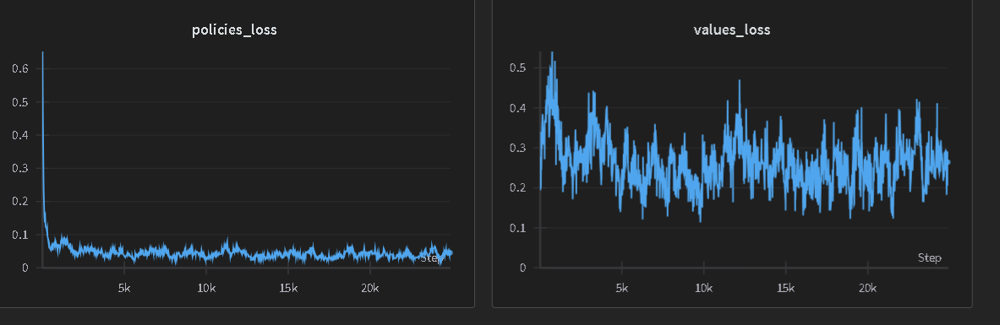

# JoJo
JoJo is a Reinformcement Learning agent trained by Monte Carlo Tree Search Method with the help of Neural Networks(implemented using Pytorch).

You'll be playing against JoJo the game of Tic-Tac-Toe, who has probably played this game more than you. So your task is to try to beat JoJo in this game(or try not to lose).

You can train your own agent by cloning/forking this repo, understand how things are implemented and you can train your own agents for various games, not only TicTacToe. Just define the rules properly and let it train.

If you have any feature that you can add to this project, feel free to open a PR and I can merge it if it's a good value addition to it as I am working alone on my weekends so it will be great to have an equally passionate partner to contribute or also if you came across any problem(there shouldn't be) you can create issue and we'll try to solve it.

You can reach me on X@[sujay_kapadnis](https://twitter.com/sujay_kapadnis)

# Game Demos
Let's see how JoJo plays the game of TicTacToe, excited?

## GamePlay 1

https://github.com/JUSTSUJAY/JoJo/assets/116516771/01e067fd-5677-469d-83b4-84c9cce0e6fc

## GamePlay 2

https://github.com/JUSTSUJAY/JoJo/assets/116516771/c3dd85bf-1ab8-4d1d-891a-dbebf0bbb09f

## Light Theme(Toggle Theme)

https://github.com/JUSTSUJAY/JoJo/assets/116516771/b69d8acb-33f4-44e4-aec1-dfb30cee316c

